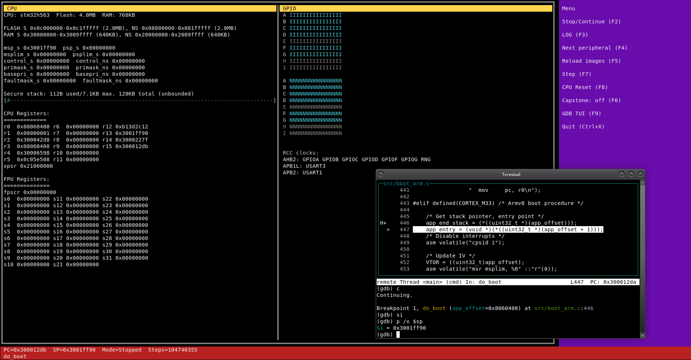
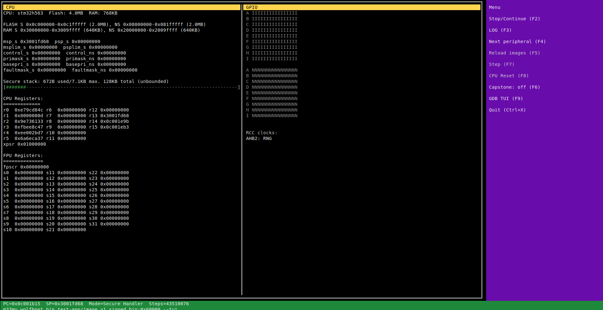
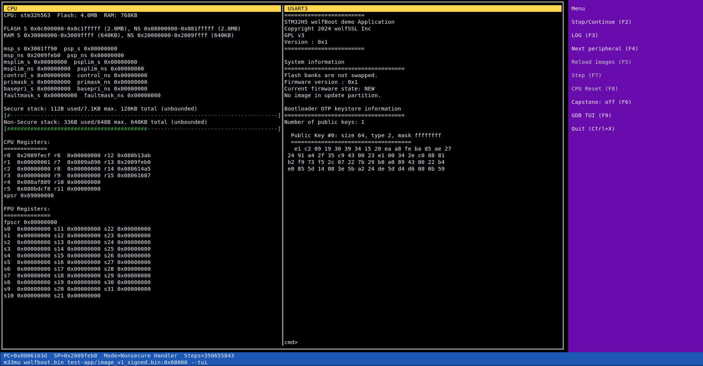

# m33mu

m33mu is a Cortex-M33 emulator.
m33mu emulates ARMv8-M Cortex-M targets with TrustZone awareness.


## Copyright / License

(c) Daniele Lacamera 2025.

Released under AGPLv3. See `LICENSE` file.


## Requirements
- ncurses (optional, for `--tui`)
- Libcapstone (for optional self-debugging)
- Libtpms (for optional TPM 2.0 emulator)


## Emulated Microcontrollers


These are the current valid `--cpu` option values:

- stm32h563 (default)
- stm32u585
- stm32l552
- mcxw71c
- nrf5340
- rp2350


## Features
- ARMv8-M baseline (Cortex-M33) CPU core
- TrustZone security extensions
- GDB remote server for debugging
- MMIO bus with pluggable peripherals
- Interrupt handling (NVIC-like)
- Memory protection unit (MPU) and security attribution unit (SAU) support
- Secure/non-secure world switching
- Secure/non-secure peripheral mapping
- Thread/Handler mode switching
- Exception handling and nesting
- Memory-mapped I/O with configurable access permissions
- Integration with Capstone for correctness verification and self-tests

## Development notes
- Peripherals: expose each device as an MMIO object behind the main bus; keep side effects localized and deterministic.
- TrustZone: model security attribution in bus lookups and peripheral instances; ensure SAU and secure fault paths are explicit.
- Testing: add focused unit tests per module; include small integration traces for fetch/execute and MMIO edges when added.
- No IDAU: trustzone segments are SAU-only.

## Repository structure
- `src/`: core CPU, decoder, scheduler/interrupt logic, GDB server.
- `cpu/`: Target specific MMIO device implementations and registration helpers.
- `include/`: public headers for core/peripheral interfaces.
- `tests/`: unit and scenario tests; runners should keep stdout stable for comparisons.
- `tui/`  : TUI for running target interactively (see `--tui` command line option)

## Generic peripherals supported:
- UART over pts / stdout / TUI
- SPI extras: SPI flash and TPM support


## Getting started
Configure and build (warnings-as-errors are enabled):

```sh
cmake -S . -B build
cmake --build build
```

Run the test suite:

```sh
ctest --test-dir build
```

Automate firmware builds/runs (Makefile-based firmware build)

```sh
cmake --build build --target firmware-build
cmake --build build --target test-firmware
cmake --build build --target test-stm32h5
cmake --build build --target test-stm32u5
cmake --build build --target test-stm32l5
cmake --build build --target test-mcxw
```

Build firmware fixtures (arm-none-eabi toolchain required):

```sh
make -C tests/firmware/test-stm32h563 app.bin
make -C tests/firmware/test-rtos-exceptions app.bin
make -C tests/firmware/test-systick-wfi app.bin
make -C tests/firmware/test-tz-bxns-cmse-sau-mpu clean all
```

Run the included sample firmwares:

- Cortex-M33 bring-up: `build/m33mu tests/firmware/test-stm32h563/app.bin`
- RTOS exception exercise (SysTick/SVC/PendSV, NVIC priorities): `build/m33mu tests/firmware/test-rtos-exceptions/app.bin`
- SysTick + WFI blocking demo: `SYSTICK_TRACE=1 build/m33mu tests/firmware/test-systick-wfi/app.bin` (shows SysTick downcounter, COUNTFLAG, pended interrupt waking WFI).
- TrustZone + CMSE + SAU + MPU (Secure+Non-secure images):
  - Build: `make -C tests/firmware/test-tz-bxns-cmse-sau-mpu clean all`
  - Run: `timeout 3s build/m33mu tests/firmware/test-tz-bxns-cmse-sau-mpu/build/secure.bin tests/firmware/test-tz-bxns-cmse-sau-mpu/build/nonsecure.bin:0x2000`

Both tests execute entirely from the in-repo binaries; no downloads required. Use `--gdb` to start the integrated GDB RSP server on port 1234, and `--record` to enable the in-memory execution trace (reverse stepping).

## Loading multiple images
`m33mu` can load more than one image into the emulated flash window. Raw binaries may include a `:offset` suffix (byte offset into flash, accepts `0x...`). ELF and Intel HEX images are auto-detected and scattered into flash by their load addresses.

Example (Secure image at offset 0, Non-secure image at offset 0x2000):

```sh
build/m33mu tests/firmware/test-tz-bxns-cmse-sau-mpu/build/secure.bin tests/firmware/test-tz-bxns-cmse-sau-mpu/build/nonsecure.bin:0x2000
```

## Command line usage

```
build/m33mu [--cpu <cpu>] [--gdb] [--port <n>] [--gdb-symbols <elf>] [--dump] [--tui] [--record] [--persist] [--capstone] [--uart-stdout] [--quit-on-faults] [--meminfo] [--no-tz] <image.bin[:offset]|image.elf|image.hex> [more images...]
```

Options:
- `--cpu <cpu>`: select the CPU profile (default: `stm32h563`).
- `--gdb`: start the GDB remote server (RSP) on port 1234 (override with `--port`).
- `--port <n>`: set the GDB server port (1-65535).
- `--gdb-symbols <elf>`: load symbols from the specified ELF (can be repeated; user-provided ELFs take priority over auto-detected ones).
- `--dump`: print per-instruction decode (`[DUMP] ...`) and selected TrustZone transitions.
- `--tui`: start the interactive terminal UI.
- `--record`: enable in-memory execution trace for reverse stepping.
- `--call-trace`: log call/return, interrupt, and TrustZone SG transitions with symbol names when available.
- `--persist`: write modified flash contents back to the input image files.
- `--capstone`: enable Capstone-based cross-check logging for decode/execute.
- `--capstone-verbose`: include operand cross-check details in Capstone logs.
- `--uart-stdout`: route UART output to stdout instead of a PTY device.
- `--quit-on-faults`: stop execution after the first fault is raised.
- `--dualbank`: enable dual-bank flash mode for STM32 targets (allows runtime bank swap).
- `--meminfo`: emit `[MEMINFO]` logs for SAU/MPU layout and register writes.
- `--no-tz`: force non-secure boot and disable TrustZone protections for the session.
- `--spiflash:SPIx:file=<path>:size=<n>[:mmap=0xaddr][:cs=GPIONAME]`: attach a SPI flash image.
- `--usb` or `--usb:port=<n>`: enable USB/IP backend (default port 3240).
- `--tap[:tap0]`: enable Ethernet TAP backend (default interface: `tap0`).
- `--vde[:/var/run/vde.ctl]`: enable Ethernet VDE backend (default socket: `/var/run/vde.ctl`).
- `--tpm:SPIx:cs=GPIONAME[:file=<path>]`: attach a TPM TIS device (optional NV backing file).

## Environment variables (optional)
- `CAPSTONE_PC=<hex>`: limit Capstone cross-check logging to a specific PC (hex).
- `M33MU_STRCMP_TRACE=<start:end>`: trace strcmp-like loops; auto-seeds entry to range start.
- `M33MU_STRCMP_ENTRY=<hex>`: override the entry PC for strcmp tracing.
- `M33MU_MEMWATCH=<addr:size>`: watch a memory range (hex address + size).
- `M33MU_NVIC_TRACE=1`: trace NVIC state changes.
- `M33MU_SYSTICK_TRACE=1`: trace SysTick register access and tick behavior.
- `M33MU_SLEEP_TRACE=1`: trace WFE/WFI sleep and wake decisions.
- `M33MU_PROT_TRACE=1..3`: print SAU/MPU attribution decisions; higher levels include region scans.

## Screenshots for TUI mode

#### m33mu TUI, stopped, stepping with GDB:



#### m33mu TUI, running in secure domain:



#### m33mu TUI, running in non-secure domain:




## Reporting issues

Please report issues to the [GitHub issue tracker](https://github.com/danielinux/m33mu/issues).

Include, if possible, a full capture using `--capstone` option, a reproducer firmware image and an explaination on how to reproduce.
